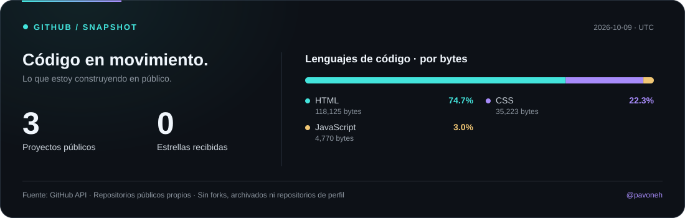

<h1 align="center">Hi, I'm Guillermo 👋</h1>

<p align="center">
  <strong>I learn, build, and share what I create along the way.</strong>
</p>

<p align="center">
  Web Development&nbsp;&nbsp;·&nbsp;&nbsp;Visual Interfaces&nbsp;&nbsp;·&nbsp;&nbsp;Software&nbsp;&nbsp;·&nbsp;&nbsp;New Projects
</p>

---

## 👨‍💻 About Me

<table>
<tr>
<td width="55%" valign="top">

I enjoy turning ideas into web experiences and caring about both **what happens behind the code** and what users ultimately see.

💡 **I build**  
My portfolio through practical, hands-on projects.

🎮 **I explore**  
Gaming, hardware, technology, and business websites.

🌱 **I keep learning**  
Strengthening my foundations while exploring new technologies.

🚀 **I share**  
My projects, experiments, and what I learn while building them.

<br>

> **I don't collect technologies. I learn the ones I need to build what I imagine.**

</td>

<td width="45%" valign="top">

```yaml
developer.config:

name: "Guillermo"
username: "@pavoneh"

role:
  "Software Developer"

location:
  "Lima, Peru"

current_focus:
  - Web Development
  - Personal Projects
  - Improving my skills

interests:
  - Gaming
  - Hardware
  - Technology
  - Web Design

philosophy:
  "Build to learn"

status:
  "Building..."
```

</td>
</tr>
</table>

---

## ⚙️ Technologies

<p>
  Tools and technologies I use and continue to learn:
</p>

<p align="center">
  
   &nbsp;&nbsp;
</p>

<p align="center">
  <sub>HTML · CSS · JavaScript · TypeScript · Java · PHP · Python · React · Tailwind CSS · Bootstrap · Git · XAMPP</sub>
</p>

---

## 🎯 Currently Building

```text
◉ Improving my personal portfolio
◉ Exploring new project ideas
◉ Strengthening my Java and web development skills
◉ Building more real-world projects

Status: ███████░░░ Building...
```

## 📊 My GitHub in Numbers

<p align="center">
  
</p>

<br>

<p align="center">
  <a href="https://github.com/pavoneh?tab=repositories">
    <strong>Explore all my repositories →</strong>
  </a>
</p>
