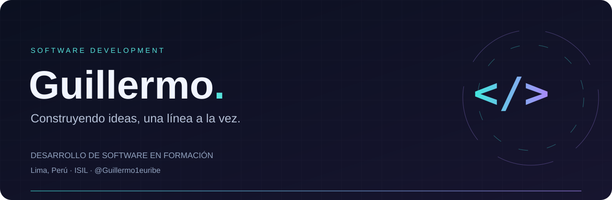
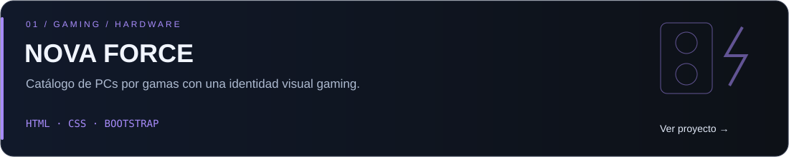
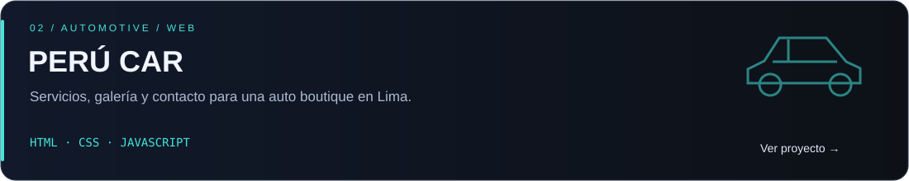
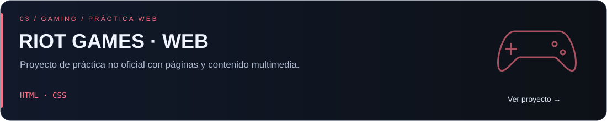

<!-- ====================================================== -->
<!--                      HEADER                            -->
<!-- ====================================================== -->

<p align="center">
  
</p>

<h1 align="center">
  Guillermo <code>@pavoneh</code>
</h1>

<p align="center">
  <strong>Software Developer focused on turning ideas into things that work.</strong>
</p>

<p align="center">
  Web Development &nbsp;•&nbsp; Software &nbsp;•&nbsp; UI &nbsp;•&nbsp; Technology
</p>

<br>


<!-- ====================================================== -->
<!--                       ABOUT                            -->
<!-- ====================================================== -->

## 👨‍💻 A little about me

I learn best when I have something to build.

Instead of collecting technologies, I prefer to understand **why and when to use them** — then put that knowledge into real projects.

Most of what you'll find here comes from curiosity: an idea, a problem I want to solve, or simply something I want to understand better.

```js id="lpr80w"
const pavoneh = {
  role: "Software Developer",

  likes: [
    "building for the web",
    "clean interfaces",
    "gaming & hardware",
    "learning how things work"
  ],

  approach: "learn → build → break → understand → improve",

  currentGoal: "make the next project better than the last"
};
```


<br>


<!-- ====================================================== -->
<!--                      TOOLBOX                           -->
<!-- ====================================================== -->

## 🧰 My toolbox

<p>
  Technologies I've worked with, used in projects, or I'm currently exploring:
</p>

<p align="center">
  
</p>

<p align="center">
  <sub>
    HTML &nbsp;·&nbsp;
    CSS &nbsp;·&nbsp;
    JavaScript &nbsp;·&nbsp;
    TypeScript &nbsp;·&nbsp;
    Java &nbsp;·&nbsp;
    PHP &nbsp;·&nbsp;
    Python &nbsp;·&nbsp;
    React &nbsp;·&nbsp;
    Tailwind CSS &nbsp;·&nbsp;
    Bootstrap &nbsp;·&nbsp;
    Git
  </sub>
</p>


<br>


<!-- ====================================================== -->
<!--                  WHAT I'M DOING                        -->
<!-- ====================================================== -->

## 🧪 What I'm working on

<table>
<tr>

<td width="33%" valign="top">

### 🔨 Build

Turning small ideas into projects that I can actually use, test and improve.

</td>

<td width="33%" valign="top">

### 🧠 Understand

Going beyond syntax and learning what happens behind the tools I use.

</td>

<td width="33%" valign="top">

### 🔁 Improve

Revisiting old projects and applying what I know now to what I built before.

</td>

</tr>
</table>


<br>


<!-- ====================================================== -->
<!--                    PROJECTS                            -->
<!-- ====================================================== -->

## 🚀 Things I've built

<p>
  A few projects that represent different stages of my learning:
</p>

<a href="https://github.com/pavoneh/novaforce-web">
  
</a>

<br>

<a href="https://github.com/pavoneh/PERU-CAR">
  
</a>

<br>

<a href="https://github.com/pavoneh/pagina-web-riotgames">
  
</a>

<p align="center">
  <a href="https://github.com/pavoneh?tab=repositories">
    <strong>See everything I'm building →</strong>
  </a>
</p>


<br>


<!-- ====================================================== -->
<!--                    GITHUB DATA                         -->
<!-- ====================================================== -->

## 📊 Behind the repositories

<p align="center">
  

  
</p>


<br>


<!-- ====================================================== -->
<!--                 CONTRIBUTIONS                         -->
<!-- ====================================================== -->

## 📈 Building in public

<p align="center">
  
</p>

<p align="center">
  <sub>
    Projects change. Technologies change. The goal stays the same: keep building.
  </sub>
</p>


<br>


<!-- ====================================================== -->
<!--                   THE LOOP                             -->
<!-- ====================================================== -->

## ♻️ The loop

<p align="center">
  <code>idea</code>
  &nbsp;→&nbsp;
  <code>build</code>
  &nbsp;→&nbsp;
  <code>break</code>
  &nbsp;→&nbsp;
  <code>debug</code>
  &nbsp;→&nbsp;
  <code>understand</code>
  &nbsp;→&nbsp;
  <code>improve</code>
  &nbsp;↻
</p>


<br>


<!-- ====================================================== -->
<!--                     FOOTER                             -->
<!-- ====================================================== -->

---

<p align="center">
  <strong>I'm not trying to know everything.</strong>
</p>

<p align="center">
  I'm trying to understand more with every project I build.
</p>

<p align="center">
  <a href="https://github.com/pavoneh?tab=repositories">
    <code>./explore-projects</code>
  </a>
</p>
