  

<h1 align="center">Hola, soy Guillermo / Hi, I'm Guillermo 👋</h1>

  <strong>Aprendo, construyo y comparto lo que voy creando.</strong> 
  Desarrollo web · Interfaces visuales · Nuevos proyectos en camino

## 👩‍💻  About Me:

Me gusta convertir ideas en experiencias web y cuidar tanto el código como su presentación.

- 🛠️ Construyo mi portafolio a través de proyectos prácticos.
- 🎮 En mis proyectos exploro el mundo gaming, el hardware y los sitios de negocios.
- 🌱 Sigo fortaleciendo mis bases y mejorando lo que ya he creado.
- 🚀 Aquí compartiré mis próximos proyectos y lo que aprenda en el camino.

**Una idea, un proyecto, algo nuevo que aprender.**

 

## Tecnologías

🛠 Language and tools:

  
 
     
     
      
     
     
     
      
     
      
     
    
  

## Mi GitHub en números

  

## Proyectos destacados

  <a href="https://github.com/pavoneh?tab=repositories"><strong>Explorar todos mis repositorios →</strong></a>

---

  <strong>Siempre hay una próxima idea por construir.</strong> 
  Gracias por visitar mi espacio. — Guillermo / pavoneh

